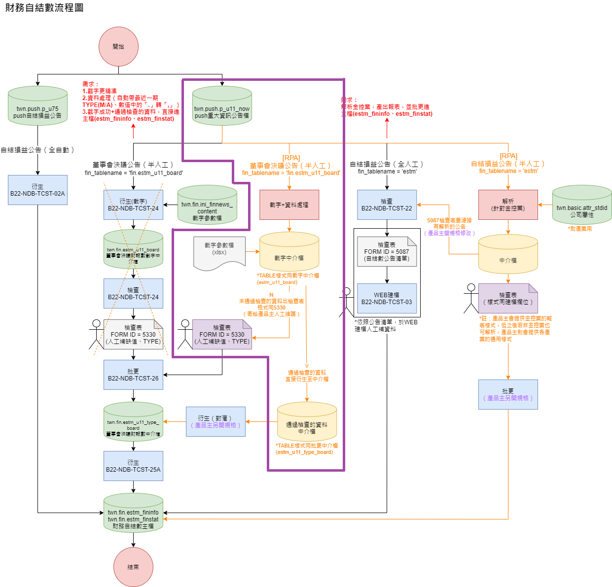

# FinancialDataSelf (財報自結數RPA專案)
本專案使用 Python 自動擷取重訊公告檔中的各科目資料，並進行資料整理與規則檢查。原始的截字資料與通過檢查的資料將分別上傳至 2 個不同的 DB，未通過檢查的資料則會生成 5330 報表 (excel) 給產品主檢查。

## 需額外安裝的套件
```
!pip install psycopg2  # 連線至 DB 需要的套件
!pip install openpyxl  # 生成 excel 檔需要的套件
```
## 專案流程
### 圖片說明
請參考紫框內的部分



### 文字說明
 - Step 1: 從 twn.push.p_u11_now 取得重訊公告檔  
 - Step 2: 判斷以上重訊公告檔先前是否已做過  
 - Step 3: 將尚未做過的重訊公告檔進行截字與資料處理  
 - Step 4: 上傳以上資料至截字中介檔 (estm_u11_board)  
 - Step 5: 檢查以上資料是否通過檢查規則，通過的上傳至 estm_u11_type_board，未通過的產生 5330 報表給產品主檢查

### 補充說明
為避免遺漏掉部分重訊公告檔，**每個交易日**早上下午會分別執行一次程式，早上會抓取 *keyin* 為本日與**過去兩個交易日**重訊公告檔，下午會抓取 *keyin* 為本日與**過去一個交易日**的重訊公告檔。  
  
舉例如下：  
 - 2025/01/14(二) 早上會取得 2025/01/14(二), 2025/01/13(一), 2025/01/10(五) 寫入的重訊公告檔  
 - 2025/01/14(二) 下午會取得 2025/01/14(二), 2025/01/13(一) 寫入的重訊公告檔


## 各資料夾說明
 - **pm**: 存放專案所需的參數
   - [config.ini](pm/config.ini): 存放連線所需的帳號密碼資訊 (需要帳號密碼請找專案負責人)
 - **output**: 存放未通過檢查的 5330 報表 (excel)
 - **python**: 存放專案中模組化的 .py 檔案與主要執行檔 ([main.py](python/main.py))

## 各 py 檔說明
1. **connect_DB.py**: 讀取 [config.ini](pm/config.ini) 檔案中的連線參數並建立連線
2. **get_DB_data.py**: 使用 SQL 語法搭配 `pd.read_sql(SQLQuery, connection)` 取得專案所需的 DB 資料
3. **extract_data_process.py**: 設定截字與資料處理相關的 function  
  注意事項：
    - 除***財務起日、財務迄日及截字fin_type***為固定的 regex，其他欄位皆透過截字參數檔設定 regex。
    - *extract_data* 為原始截字資料的暫存資料表
    - 截字結果與資料處理後的資料皆會儲存在 *extract* 資料表
    - 所有日期相關欄位皆需轉換為 YYYYMMDD 格式或是 None (沒截到資料或是日期格式錯誤) 才能匯入資料庫
    - 若有負數以 (123,456) 表示，需去掉括號並加上`-`
    - 沒有小數點的科目需要去掉`,`或誤植的`.`，並轉換為整數
    - 有小數點的科目(目前僅***每股盈餘***)要把誤植的`,`換成`.`，並轉換為浮點數
    - ***其他應敘明事項***要將換行符 ('\n', '\u3000') 以及空格 (' ') 刪除
4. **check_rules_to_5330.py**: 檢查截字資料是否符合[自結數截字規則](自結數截字規則20250115.docx)，並將未通過檢查的資料輸出成 5330 報表 (excel)  
  注意事項：
    - 5330 中的日期欄位皆要轉換為**民國年**的格式
    - 5330 的資料順序要依序按照***公司碼、發言日期、則次、合併M/個別A***由小到大排列
    - 5330 報表將存放於 [output](output) 資料夾
5. **upload_DB.py**: 將整理好的資料上傳至 DB  
  注意事項：
    - 上傳前要將 *extract* 的欄位改成英文的
6. **main.py**: 為本專案的主要執行程式  
  注意事項：
    - 若執行程式時發現重訊公告無資料，就會結束程式
    - 若重訊公告檔的 *filename* 與 estm_u11_board 的 *filename* 有重複 (即先前已做過)，將刪除這些重複的資料再進行截字

